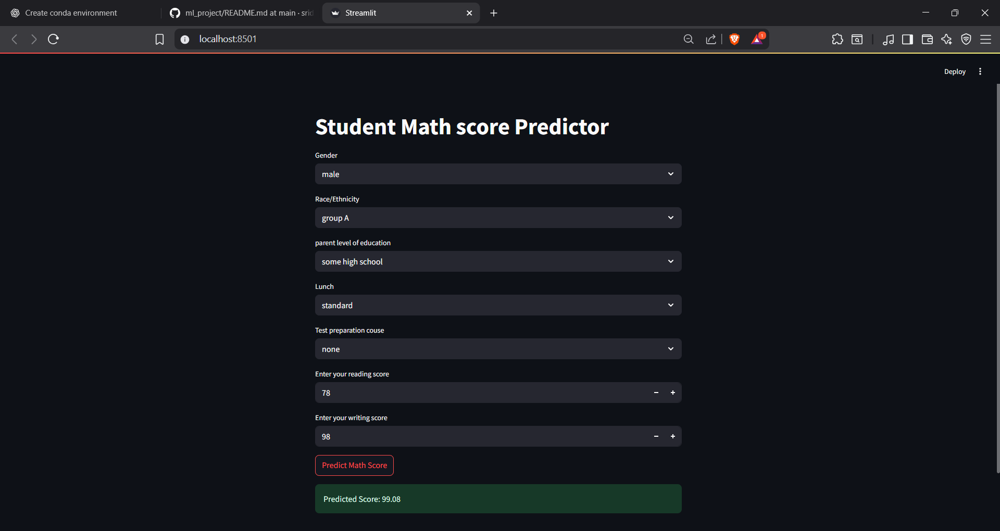

### End to End Machine Learning Project.

# 🎓 ExamScore Predictor – A Student Performance Forecasting App

This project predicts student scores in Math, Reading, and Writing using a machine learning model. Built with Streamlit for an interactive UI, it provides insights based on demographic and educational background data.

---

## 📁 Dataset

- Source: [Kaggle – Students Performance in Exams]( https://www.kaggle.com/datasets/spscientist/students-performance-in-exams?datasetId=74977)
- 1000 rows × 8 columns
- Key columns: gender, race/ethnicity, parental education, lunch type, test preparation, and three scores.

---

## 🧪 Workflow

### 1. 📥 Data Collection
- Imported dataset from Kaggle using Pandas
- Removed duplicates using `df.drop_duplicates()`
- Checked data types and null values using `df.info()`

### 2. 🧼 Data Preprocessing
- Converted categorical columns using encoding techniques
- Handled missing values (if any)
- Normalized scores (optional)

### 3. 📊 Exploratory Data Analysis
- Analyzed distribution of scores by gender, education level, and more
- Used Matplotlib & Seaborn for visual insights

### 4. 🤖 Model Building
- Trained ML models like Linear Regression, Decision Tree, and Random Forest
- Evaluated using metrics like R² Score, MAE, and RMSE

### 5. 🌐 Streamlit Frontend
- Built a user-friendly web interface
- Users can input student info to predict expected scores
- Included visualization dashboards for insights

## 📸 Frontend page


# 🧠 Student Performance Prediction

This Streamlit app predicts student math scores based on various features like reading score, writing score, gender, etc.
---

## 🚀 How to Run

```bash
# Install dependencies
pip install -r requirements.txt

# Run the Streamlit app
streamlit run app.py
